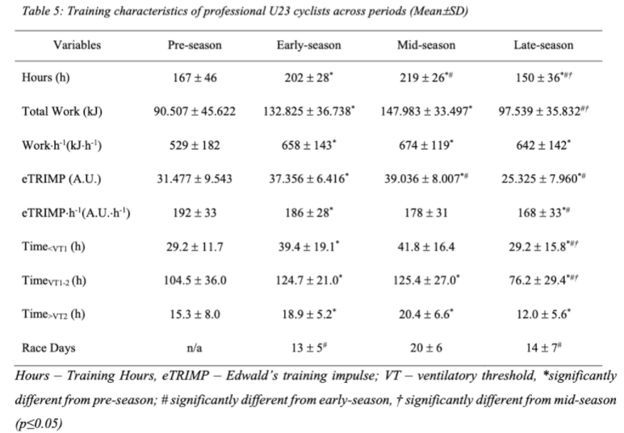
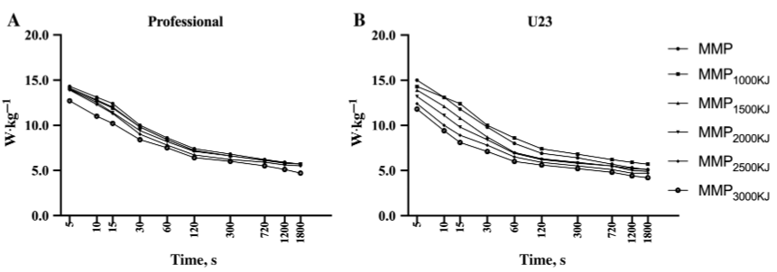

```{r setup, include=FALSE}
# GET /api/athlete/{id}/wellness?oldest=2021-09-10&newest=2022-01-17
# https://intervals.icu/api/athlete/i38205/activities.csv
# i si profil créer sur intervals et sinon jsute les chiffres si créer avec strava
# nom athlète
athlete <- "Charles-Étienne Chrétien"
# data
metriques_csv <- "i48443_activities.csv"
records_csv <- "athlete_i48443_power_curves.csv"
# selection période
selection_debut <- "2021-01-01"
selection_fin <- "2021-12-31" 
# déoucpage période
intervalle <- "1 month"

# nom pour YAML
nom_yaml <- paste0(athlete)
date_yaml <- paste0(selection_debut, " - ", selection_fin)

knitr::opts_chunk$set(
   echo = FALSE,
   message = FALSE,
   warning = FALSE,
   fig.align = "center",
   fig.pos = "!ht")

options(knitr.table.format = "latex")

# éviter notation scientifique pour chiffre
options(scipen = 999)

# packages 
library(tidyverse)
library(gridExtra)
library(grid)
library(googlesheets4)
library(forcats)
library(knitr)
library(kableExtra)
library(plotly)
library(webshot)
library(forcats)
library(RCurl)
library(httr)
require(downloader)
library(lubridate)
library(zoo)
library(roll)
library(TTR)
library(gridExtra)
library(cyclingtools)
library(gridGraphics)
library(corrplot)
```

---
author: `r date_yaml`
date: `r nom_yaml`
---

\vspace{12pt}
\vspace{12pt}
\vspace{12pt}
\vspace{12pt}
\vspace{12pt}
\vspace{12pt}
\vspace{12pt}
\vspace{12pt}
\vspace{12pt}
\vspace{12pt}
\vspace{12pt}
\vspace{12pt}

\center Analyse et production \center 
\center __Jules Cusson-Fradet__, M.Sc. \center 
\center Candidat au doctorat \center 
\center Laboratoire de technologies & d'innovation pour la performance sportive (L-Tips) \center

\newpage

```{r cleaning}
metriques <- read_csv(metriques_csv)
records <- read_csv(records_csv)

# vars à additioner si plus de 1 entraînement/jour
vars_sum <-
   as.character(
      expression(
         moving_time,
         distance,
         elapsed_time,
         total_elevation_gain,
         calories,
         icu_joules,
         icu_training_load,
         hr_z1_secs,
         hr_z2_secs,
         hr_z3_secs,
         hr_z4_secs,
         hr_z5_secs,
         hr_z6_secs,
         hr_z7_secs,
         z1_secs,
         z2_secs,
         z3_secs,
         z4_secs,
         z5_secs,
         z6_secs,
         z7_secs
      )
   )

# vars à prendre le max si plusieurs entraînements/jour
vars_max <-
   as.character(
      expression(
         max_speed,
         max_heartrate,
         icu_eftp,
         icu_pm_ftp,
         icu_pm_cp,
         icu_pm_w_prime,
         icu_pm_p_max,
         icu_hrrc,
         icu_ftp,
         icu_w_prime,
         icu_weight 
      )
   )

# vars à prendre le avg si plusieurs entraînements/jour
vars_avg <-
   as.character(
      expression(
         average_speed,
         average_heartrate,
         average_cadence,
         icu_average_watts,
         icu_normalized_watts,
         icu_intensity,
         icu_variability,
         icu_efficiency
      )
   )

# calculer metriques par jour si plusieurs entraînements
metriques_sum <- metriques %>%
   # dttm en date
   mutate(date = date(start_date)) %>%
   group_by(date) %>%
   summarise_at(vars(vars_sum), sum, na.rm = FALSE)

metriques_max <- metriques %>%
   # dttm en date
   mutate(date = date(start_date)) %>%
   group_by(date) %>%
   summarise_at(vars(vars_max), max, na.rm = FALSE)

metriques_avg <- metriques %>%
   # dttm en date
   mutate(date = date(start_date)) %>%
   group_by(date) %>%
   summarise_at(vars(vars_avg), mean, na.rm = FALSE)

# joindre en un df  calculs vars
df_1 <- merge(metriques_sum, metriques_max, all = TRUE)
df_2 <- merge(df_1, metriques_avg, all = TRUE) 

# extraire valeur max
fc_max <- df_2 %>% 
   select(max_heartrate) %>% 
   slice(which.max(max_heartrate))

cp_max <- df_2 %>% 
   select(icu_ftp) %>% 
   slice(which.max(icu_ftp))

poids_kg <- df_2 %>% 
   select(icu_weight) %>% 
   slice(which.max(icu_weight))
   
# calculs vars
metriques_clean <- df_2 %>%
   # selection période
   filter(between(date, as.Date(selection_debut), as.Date(selection_fin))) %>%
   # création des variables
   group_by(date) %>%
   mutate(
      # luTRIMP 3 zones
      lutrimp_zone1 = (hr_z1_secs + hr_z2_secs * 1),
      lutrimp_zone2 = (hr_z3_secs + hr_z4_secs * 2),
      lutrimp_zone3 = (hr_z5_secs + hr_z6_secs + hr_z7_secs * 3),
      lutrimp = lutrimp_zone1 + lutrimp_zone2 + lutrimp_zone3,
      # puissance 3 zones
      zone1 = (z1_secs + z2_secs),
      zone2 = (z3_secs + z4_secs),
      zone3 = (z5_secs + z6_secs + z7_secs),
      zone1_h = zone1 / 3600,
      zone2_h = zone2 / 3600,
      zone3_h = zone3 / 3600
   ) %>%
   ungroup() %>%
   mutate_at(vars(c(icu_training_load, icu_joules, lutrimp)), ~ replace(., is.na(.), 0)) %>%
   mutate(
      # lutrimp
      # réduire valeur pour concordance échelle avec autre charge
      lutrimp_divised = lutrimp / 100,
      aigue_7_lutrimp = EMA(lutrimp_divised, n = 1, ratio = 2 / (1 + 7)),
      chronique_42_lutrimp = EMA(lutrimp_divised, n = 1, ratio = 2 / (1 + 42)),
      ACWR_lutrimp = aigue_7_lutrimp / chronique_42_lutrimp,
      ACWR_lutrimp_ravg = rollapply(
         ACWR_lutrimp,
         7,
         mean,
         na.rm = TRUE,
         fill = NA,
         align = 'right',
         partial = TRUE
      ),
      # tss
      aigue_7_tss = EMA(icu_training_load, n = 1, ratio = 2 / (1 + 7)),
      chronique_42_tss = EMA(icu_training_load, n = 1, ratio = 2 / (1 + 42)),
      fraicheur_tss = (chronique_42_tss - aigue_7_tss) / 100,
      ACWR_tss = aigue_7_tss / chronique_42_tss,
      # kj
      icu_kj = icu_joules / 1000,
      # réduire valeur pour concordance échelle avec autre charge
      icu_joules_divised = icu_joules / 10000,
      aigue_7_kj = EMA(icu_joules_divised, n = 1, ratio = 2 / (1 + 7)),
      chronique_42_kj = EMA(icu_joules_divised, n = 1, ratio = 2 / (1 + 42)),
      fraicheur_kj = (chronique_42_kj - aigue_7_kj) / 10,
      icu_joules_divised_7 = rollapply(
      icu_joules_divised, 
      7,
      mean,
      na.rm = TRUE,
      fill = NA,
      align = 'right',
      partial = TRUE
    ),
      icu_joules_divised_7_sd = roll_sd(icu_joules_divised, 7, min_obs = 1),
      monotonie_kj = round(icu_joules_divised_7 / icu_joules_divised_7_sd, digits = 1),
      ACWR_kj = aigue_7_kj / chronique_42_kj,
      ACWR_kj_ravg = rollapply(
         ACWR_kj,
         7,
         mean,
         na.rm = TRUE,
         fill = NA,
         align = 'right',
         partial = TRUE
      ),
      # efficacité aérobique
      efficacite_aerobique = icu_average_watts / average_heartrate,
      efficacite_aerobique_ravg7 = rollapply(
         efficacite_aerobique,
         7,
         mean,
         na.rm = TRUE,
         fill = NA,
         align = 'right',
         partial = TRUE
      ),
      efficacite_aerobique_ravg60 = rollapply(
         efficacite_aerobique,
         60,
         mean,
         na.rm = TRUE,
         fill = NA,
         align = 'right',
         partial = TRUE
      ),
      efficacite_aerobique_norm = 0.75 * (roll_sd(efficacite_aerobique, 60, min_obs = 1)),
      # conversions
      temps_h = round(moving_time / 3600, digits = 1),
      kj_h = icu_kj / temps_h,
      lutrimp_h = lutrimp / temps_h
   ) %>%
   # 0 si valeur abbérante
   mutate_if(is.numeric, function(x)
      ifelse(is.infinite(x), 0, x)) %>%
   # 0 si NaN
   mutate_if(is.numeric, function(x)
      ifelse(is.nan(x), 0, x)) %>%  
   # filtrer valeurs abbérantes
   mutate(
      monotonie_kj = ifelse(monotonie_kj >= 10, "0", monotonie_kj)
   )
   
# déoucpage période
datebreaks <- seq(as.Date(selection_debut), as.Date(selection_fin), by = intervalle)

records_clean <- records %>%
   janitor::clean_names() %>%
   # sélectionner première 4 cols pour l'année coutante filtrer via intervals.icu
   select(1:4) %>%
   rename(
      "saison" = 2,
      "saison_2000_kj" = 3,
      "saison_3000_kj" = 4
   ) %>%
   mutate(
      saison_wkg = round(saison / poids_kg$icu_weight, digits = 1),
      saison_2000_kj_wkg = round(saison_2000_kj / poids_kg$icu_weight, digits = 1),
      saison_3000_kj_wkg = round(saison_3000_kj / poids_kg$icu_weight, digits = 1)
   )
```

**Comparaison de différentes méthodes de quantification de la charge d'entraînement**

```{r TL, fig.cap="Méthodes de quantification de la charge d'entraînement externe (Watts, Travail) et interne (Fréquence cardiaque). \\newline{}\\textbf{Charge d'entraînement chronique}: représente la charge globale que votre corps est habitué à supporter (derniers 42 jours). En général, vous pouvez voir la charge chronique comme un indicateur du niveau de forme physique: plus votre corps peut s'entraîner, plus vous êtes en forme. \\newline{}\\textbf{Charge d'entraînement aigue}: représente votre charge d'entraînement au cours de la dernière semaine (derniers 7 jours). La charge d'entraînement aigue est liée à la fatigue: l'augmentation de la fréquence des entraînements intenses au cours des derniers jours entraîne une fatigue plus élevée.", fig.width=11, fig.height=11.5}
gg_tss <-
   ggplot(metriques_clean, aes(date, weight = icu_training_load)) +
   geom_vline(
      xintercept = datebreaks,
      color = "#999999",
      size = 0.25,
      linetype = "dashed"
   ) +
   geom_bar(aes(fill = "")) +
   geom_area(aes(y = aigue_7_tss), fill = "#FF8247", alpha = 0.85) +
   geom_line(aes(y = aigue_7_tss, group = 1, color = "Aigue (7 jours)"), size =
                1.25) +
   geom_area(aes(y = chronique_42_tss), fill = "#1E90FF", alpha = 0.5) +
   geom_line(aes(y = chronique_42_tss, group = 1, color = "Chronique (42 jours)"),
             size = 1.25) +
   scale_color_manual(
      name = "",
      values = c("Aigue (7 jours)" = "#FF8247",
                 "Chronique (42 jours)" = "#1E90FF"),
      drop = FALSE
   ) +
   scale_fill_manual(name = "",
                    values = alpha("grey"),
                    labels = "Données journalières",
                    drop = FALSE) +
   labs(y = "(TSS)\n", x = "") +
   ggtitle("Charge: training stress score (TSS)") +
   theme_minimal() +
   theme(
      legend.position = "top",
      legend.title = element_blank(),
      axis.ticks.y = element_blank(),
      axis.title.x = element_blank(),
      axis.text.x = element_blank(),
      axis.title.y = element_text(colour = "#A6A6A6"),
      axis.text.y = element_text(colour = "#A6A6A6"),
      panel.grid.major.x = element_blank(),
      panel.grid.minor.x = element_blank(), 
      legend.margin = margin(t = 0, unit = 'cm')
   ) +
   guides(color = guide_legend(order = 1),
          fill = guide_legend(order = 2))

gg_kj <-
   ggplot(metriques_clean, aes(date, weight = icu_joules_divised)) +
   geom_vline(
      xintercept = datebreaks,
      color = "#999999",
      size = 0.25,
      linetype = "dashed"
   ) +
   geom_bar(aes(fill = "")) +
   geom_area(aes(y = aigue_7_kj), fill = "#FF8247", alpha = 0.85) +
   geom_line(aes(y = aigue_7_kj, group = 1, color = "Aigue (7 jours)"), size =
                1.25) +
   geom_area(aes(y = chronique_42_kj), fill = "#1E90FF", alpha = 0.5) +
   geom_line(aes(y = chronique_42_kj, group = 1, color = "Chronique (42 jours)"),
             size = 1.25) +
   scale_color_manual(
      name = "",
      values = c("Aigue (7 jours)" = "#FF8247",
                 "Chronique (42 jours)" = "#1E90FF"),
      drop = FALSE
   ) +
   scale_fill_manual(name = "",
                    values = alpha("grey"),
                    labels = "Données journalières",
                    drop = FALSE) +
   labs(y = "Kilojoules simplifiés (kJ)\n", x = "") +
   ggtitle("Charge: travail simplifié (kJ)") +
   theme_minimal() +
   theme(
      legend.position = "top",
      legend.title = element_blank(),
      axis.ticks.y = element_blank(),
      axis.title.x = element_blank(),
      axis.text.x = element_blank(),
      axis.title.y = element_text(colour = "#A6A6A6"),
      axis.text.y = element_text(colour = "#A6A6A6"),
      panel.grid.major.x = element_blank(),
      panel.grid.minor.x = element_blank(), 
      legend.margin = margin(t = 0, unit = 'cm')
   ) +
   guides(color = guide_legend(order = 1),
          fill = guide_legend(order = 2))

gg_trimp <-
   ggplot(metriques_clean, aes(date, weight = lutrimp_divised)) +
   geom_vline(
      xintercept = datebreaks,
      color = "#999999",
      size = 0.25,
      linetype = "dashed"
   ) +
   geom_bar(aes(fill = "")) +
   geom_area(aes(y = aigue_7_lutrimp), fill = "#FF8247", alpha = 0.85) +
   geom_line(aes(y = aigue_7_lutrimp, group = 1, color = "Aigue (7 jours)"), size =
                1.25) +
   geom_area(aes(y = chronique_42_lutrimp),
             fill = "#1E90FF",
             alpha = 0.5) +
   geom_line(aes(y = chronique_42_lutrimp, group = 1, color = "Chronique (42 jours)"),
             size = 1.25) +
   scale_color_manual(
      name = "",
      values = c("Aigue (7 jours)" = "#FF8247",
                 "Chronique (42 jours)" = "#1E90FF"),
      drop = FALSE
   ) +
   scale_fill_manual(name = "",
                    values = alpha("grey"),
                    labels = "Données journalières",
                    drop = FALSE) +
   labs(y = "LuTRIMP (UA)\n", x = "") +
   scale_x_date(breaks = datebreaks, date_labels = "%b") +
   ggtitle("Charge: Lucia's training impulse (fréquence cardiaque)") +
   theme_minimal() +
   theme(
      legend.position = "top",
      legend.title = element_blank(),
      axis.ticks.y = element_blank(),
      axis.title.x = element_blank(),
      axis.title.y = element_text(colour = "#A6A6A6"),
      axis.text.x = element_text(colour = "#A6A6A6"),
      axis.text.y = element_text(colour = "#A6A6A6"),
      panel.grid.major.x = element_blank(),
      panel.grid.minor.x = element_blank(),
      legend.margin = margin(t = 0, unit = 'cm')
   ) +
   guides(color = guide_legend(order = 1),
          fill = guide_legend(order = 2))

gg_acwr_kj <-
   ggplot(metriques_clean, aes(x = date, y = ACWR_kj, fill = ACWR_kj)) +
   geom_vline(
      xintercept = datebreaks,
      color = "#999999",
      size = 0.25,
      linetype = "dashed"
   ) +
   geom_bar(stat = "identity", aes(fill = cut(ACWR_kj, c(
      -Inf, 0.8, 1.3, 1.5, Inf
   )))) +
   scale_fill_manual(
      name = "",
      values = c(
         "(-Inf,0.8]" = "grey",
         "(0.8,1.3]" = "#00FA9A",
         "(1.3,1.5]" = "#EEB422",
         "(1.5, Inf]" = "#FF6A6A"
      ),
      labels = c(
         "Faible charge, risque quelconque",
         "Charge optimale",
         "Risque moyen",
         "Risque élevé"
      ),
      drop = FALSE
   ) +
   labs(y = "(aigue/chronique)\n", x = "") +
   ggtitle("Risque de maladaptation") +
   theme_minimal() +
   #match order risque blessure
   guides(fill = guide_legend(reverse = TRUE)) +
   theme(
      legend.position = "top",
      legend.title = element_blank(),
      axis.ticks.y = element_blank(),
      axis.title.x = element_blank(),
      axis.text.x = element_blank(),
      axis.title.y = element_text(colour = "#A6A6A6"),
      axis.text.y = element_text(colour = "#A6A6A6"),
      panel.grid.major.x = element_blank(),
      panel.grid.minor.x = element_blank(), 
      legend.margin = margin(t = 0, unit = 'cm')
   )

gg_fra_kj <-
   ggplot(metriques_clean,
          aes(x = date, y = fraicheur_kj, fill = fraicheur_kj)) +
   geom_vline(
      xintercept = datebreaks,
      color = "#999999",
      size = 0.25,
      linetype = "dashed"
   ) +
   geom_bar(stat = "identity", aes(fill = cut(fraicheur_kj, c(
      -Inf,-0.5, 0, 0.9, Inf
   )))) +
   scale_fill_manual(
      name = "",
      values = c(
         "(-Inf,-0.5]" = "#FF6A6A",
         "(-0.5,0]" = "#EEB422",
         "(0,0.9]" = "#00FA9A",
         "(0.9, Inf]" = "grey"
      ),
      labels = c(
         "Très haute charge aigue, faible fraîcheur",
         "Haute charge aigue",
         "Prêt à performer",
         "Faible charge, récupération"
      ),
      drop = FALSE
   ) +
   labs(y = "(chronique - aigue)\n", x = "") +
   ggtitle("Fraîcheur") +
   theme_minimal() +
   theme(
     legend.position = "top",
      legend.title = element_blank(),
      axis.ticks.y = element_blank(),
      axis.title.x = element_blank(),
      axis.text.x = element_blank(),
      axis.title.y = element_text(colour = "#A6A6A6"),
      axis.text.y = element_text(colour = "#A6A6A6"),
      panel.grid.major.x = element_blank(),
      panel.grid.minor.x = element_blank(), 
      legend.margin = margin(t = 0, unit = 'cm')
   )

gg_mono_kj <-
   ggplot(metriques_clean,
          aes(x = date, y = monotonie_kj, fill = monotonie_kj)) +
   geom_vline(
      xintercept = datebreaks,
      color = "#999999",
      size = 0.25,
      linetype = "dashed"
   ) +
   geom_bar(stat = "identity", aes(fill = cut(monotonie_kj, c(0, 1.5, 2, Inf)))) +
   scale_fill_manual(
      name = "",
      values = c(
         "(0,1.5]" = "#00FA9A",
         "(1.5,2]" = "#EEB422",
         "(2,Inf]" = "#FF6A6A"
      ),
      labels = c(
         "Entraînement variable (faible monotonie)",
         "Entraînement modérément variable",
         "Entraînement très répétitif (monotonie élevée)"
      ),
      drop = FALSE
   ) +
   labs(y = "Variabilité (7j)\n", x = "") +
   scale_x_date(breaks = datebreaks, date_labels = "%b") +
   ggtitle("Monotonie") +
   theme_minimal() +
   #match order risque blessure
   guides(fill = guide_legend(reverse = TRUE)) +
   theme(
      legend.position = "top",
      legend.title = element_blank(),
      axis.ticks.y = element_blank(),
      axis.title.x = element_blank(),
      axis.title.y = element_text(colour = "#A6A6A6"),
      axis.text.x = element_text(colour = "#A6A6A6"),
      axis.text.y = element_text(colour = "#A6A6A6"),
      panel.grid.major.x = element_blank(),
      panel.grid.minor.x = element_blank(),
      legend.margin = margin(t = 0, unit = 'cm')
   )

graphs <- grid.arrange(
   arrangeGrob(gg_tss, ncol = 1, nrow = 1),
   arrangeGrob(gg_kj, ncol = 1, nrow = 1),
   arrangeGrob(gg_trimp, ncol = 1, nrow = 1),  
   heights = c(3.3, 3.3, 3.3)
)
```

\pagenumbering{arabic}

\newpage

**Aperçu global de la charge d'entraînement et des mesures descriptives**

```{r global,  fig.cap="Évolution de la charge d’entraînement et des mesures descriptives au cours de la saison. \\newline{}\\textbf{Risque de maladaptation}: le rapport entre votre charge d'entraînement aigue et votre charge chronique peut être utilisé pour déterminer le risque de maladaptation ou de blessure. Une charge d'entraînement aigue élevée et une charge d'entraînement chronique faible sont des signes avant-coureurs de maladaptation à l'entraînement puisque nous stressons le corps plus qu'il n'en a l'habitude. \\newline{}\\textbf{Fraîcheur}: la différence entre votre charge chronique (≈forme) et votre charge aigue (≈fatigue) peut être utilisée pour déterminer le niveau de préparation à la performance. Une valeur optimale est généralement un peu au-dessus de zéro. \\newline{}\\textbf{Monotonie}: fait référence à la similitude de l'entraînement sur une période de 7 jours. Une faible monotonie est normalement associée à des méthodes de périodisation alternant des entraînements à haute et basse intensité. Une valeur élevée indique que l'entraînement peut être inefficace et conduire à une stagnation ou à un manque d'amélioration.", fig.width=11, fig.height=10.15}
graphs <- grid.arrange(
   arrangeGrob(gg_kj, ncol = 1, nrow = 1),
   arrangeGrob(gg_acwr_kj, ncol = 1, nrow = 1),
   arrangeGrob(gg_fra_kj, ncol = 1, nrow = 1),
   arrangeGrob(gg_mono_kj, ncol = 1, nrow = 1),
   heights = c(3, 2.125, 2.75, 2.125)
)
```

\newpage

**Modélisations des paramètres de puissance critique (CP) et de W'**

```{r tabCP}
data_cp <- records_clean %>% 
   select(secs, saison) %>% 
   rename(
      TTE = secs,
      PO = saison
   ) %>% 
   na.omit() %>% 
   # records saison entre 3min et 20min
   filter(TTE %in% c(180:1200))

# data_cp_tab <- data_cp %>% 
#     mutate(
#       TTE = as.factor(TTE),
#       TTE = fct_recode(
#          TTE,
#          "2m @" = "120",
#          "3m @"  = "180",
#          "5m @" = "300",
#          "12m @" = "900",
#          "20m @" = "1200"
#       ),
#       PO = paste0(PO, "W")
#     ) %>% 
#    add_column(
#       "numero" = c("(1)",
#                    "(2)",
#                    "(3)",
#                    "(4)",
#                    "(5)"),
#       .before = "TTE"         
#    ) %>% 
#    mutate(
#       "Sélection records" = paste(numero, TTE, PO)
#    ) 
# 
# combinations_results <- critical_power(
#   .data = data_cp, 
#   power_output_column = "PO", 
#   time_to_exhaustion_column = "TTE", 
#   method = c("3-hyp", "2-hyp", "linear", "1/time"), 
#   plot = TRUE, 
#   all_combinations = TRUE,
#   reverse_y_axis = FALSE
# ) 

simple_results <- critical_power(
  .data = data_cp, 
  power_output_column = "PO", 
  time_to_exhaustion_column = "TTE", 
  method = c("1/time"), 
  plot = TRUE, 
  all_combinations = FALSE,
  reverse_y_axis = FALSE
)

# cp <- combinations_results %>% 
#   slice_min(RMSE, n = 1) %>% 
#   dplyr::pull(CP)
# 
# W <- combinations_results %>% 
#   slice_min(RMSE, n = 1) %>%
#   dplyr::pull(`W'`)

cp <- simple_results %>% 
  filter(method == "1/time") %>% 
  dplyr::pull(CP)

W <- simple_results %>% 
   filter(method == "1/time") %>% 
   dplyr::pull(`W'`)

# tableau calculs
tab_cp <- simple_results %>%
   select(method, CP:"W' SEE", R2, RMSE) %>%
   filter(method == "1/time") %>%
   rename("Méthode" = "method",
          "CP (Watts)" = CP,
          "W' (Joules)" = "W'") %>%
   kable(
      escape = FALSE,
      align = c("l", "c", "c", "c", "c", "c", "c"),
      booktabs = T,
      linesep = "",
      caption = "Estimation de la puissance critique et du W' à partir des records de puissance de la saison entre 3 minutes et 20 minutes"
   ) %>%
   kable_styling(latex_options = c("hold_position")) %>%
   row_spec(0, bold = T) %>%
   footnote(
      general_title = "",
      general = "1/time, modèle linéaire 1/temps; CP, puissance critique; W’, réserve d'énergie > CP; SEE, erreur type de l'estimation; R2, coefficient de détermination linéaire de Pearson; RMSE, erreur quadratique moyenne.",
      threeparttable = T,
      fixed_small_size = T
   )

# tab_cp <- simple_results %>%
#    select(index, method, CP:"W' SEE", RMSE) %>%
#    slice_min(RMSE, n = 5) %>%
#    mutate(index = str_extract(index, "(?<=\\[).+?(?=\\])"),
#           index = paste0("(", index, ")")) %>%
#    add_column("Sélection records" = data_cp_tab$`Sélection records`,
#               .before = "index") %>%
#    rename("Combinaison" = "index",
#           "Méthode" = "method") %>%
#    kable(
#       escape = FALSE,
#       align = c("l", "c", "c", "c", "c", "c", "c", "c"),
#       booktabs = T,
#       linesep = "",
#       caption = "Estimation de la puissance critique à partir d'une combinaisons de 5 records de puissance"
#    ) %>%
#    kable_styling(latex_options = c("scale_down", "hold_position")) %>%
#    row_spec(0, bold = T) %>%
#    footnote(
#       general_title = "",
#       general = "74 combinaisons testées pour 4 méthodes (3-hyp, 2-hyp, linear, 1/time), seules les 5 meilleures sont présentées. 3-hyp, modèle hyperbolique à 3 paramètres; 2-hyp, modèle hyperbolique à 2 paramètres; linear, modèle linéaire; 1/time, modèle linéaire 1/temps; CP, puissance critique; W’, réserve d'énergie > CP; SEE, erreur type de l'estimation; RMSE, erreur quadratique moyenne.",
#       threeparttable = T,
#       fixed_small_size = T
#    )

tab_cp
```

\vspace{12pt}
\vspace{12pt}

```{r CP, fig.cap="Représentation graphique de la modélisation."}
gg_cp <- data_cp %>%
   mutate(cp_model = cp + W / TTE) 

gg <- gg_cp %>% 
   ggplot(aes(x = TTE)) +
   geom_line(aes(y = PO,
                 colour = "Profil de puissance record"),
             size = 1.25) +
   geom_line(aes(y = cp_model,
                 colour = "Profil de puissance modélisé"),
             size = 1.25) +
   scale_color_manual(
      name = "",
      values = alpha(c("red",
                       "#6633CC"), .6),
      drop = FALSE,
      guide = guide_legend(reverse = TRUE)
   ) +
   scale_y_continuous(breaks = seq(
      from = min(round(gg_cp$cp_model -20), na.rm = TRUE),
      to = max(round(gg_cp$cp_model +10), na.rm = TRUE),
      by = 10
   )) +
   coord_cartesian(ylim = c(min(round(gg_cp$cp_model -20), na.rm = TRUE), max(round(gg_cp$cp_model +10), na.rm = TRUE)),
                   expand = TRUE,
                   default = TRUE) +
   scale_x_time() +
   labs(y = "Puissance (Watts)\n",
        x = "\nTemps (h:m:s)",
        color = "") +
   ggtitle("") +
   theme_minimal() +
   theme(
      axis.text.x = element_text(colour = "#A6A6A6"),
      axis.text.y = element_text(colour = "#A6A6A6"),
      axis.title.x = element_text(colour = "#A6A6A6"),
      axis.title.y = element_text(colour = "#A6A6A6"),
      panel.grid.minor.y = element_blank(),
      panel.grid.minor.x = element_blank(),
      legend.position = "top"
   )

gg
```

\newpage

Zones d'entraînement établies à partir d'une puissance critique de **`r round(cp)`** Watts

```{r zonesW}
zones_p <- metriques_clean %>%
  mutate(
    z1_min = round(cp_max / 100 * 0),
    z1_max = round(cp_max / 100 * 55),
    z2_min = round(cp_max / 100 * 55),
    z2_max = round(cp_max / 100 * 75),
    z3_min = round(cp_max / 100 * 75),
    z3_max = round(cp_max / 100 * 90),
    z4_min = round(cp_max / 100 * 90),
    z4_max = round(cp_max / 100 * 105),
    z5_min = round(cp_max / 100 * 105),
    z5_max = round(cp_max / 100 * 120),
    z6_min = round(cp_max / 100 * 120),
    z6_max = round(cp_max / 100 * 150),
    z7_min = round(cp_max / 100 * 150),
    z7_max = "+"
  ) %>%
  select(
    z1_min,
    z1_max,
    z2_min,
    z2_max,
    z3_min,
    z3_max,
    z4_min,
    z4_max,
    z5_min,
    z5_max,
    z6_min,
    z6_max,
    z7_min,
    z7_max
  ) %>%
  slice(1) %>%
  mutate(
    "Z1" = paste(z1_min, z1_max, sep = " - "),
    "Z2" = paste(z2_min, z2_max, sep = " - "),
    "Z3" = paste(z3_min, z3_max, sep = " - "),
    "Z4" = paste(z4_min, z4_max, sep = " - "),
    "Z5" = paste(z5_min, z5_max, sep = " - "),
    "Z6" = paste(z6_min, z6_max, sep = " - "),
    "Z7" = paste(z7_min, z7_max, sep = " - ")
  ) %>%
  select("Z1",
         "Z2",
         "Z3",
         "Z4",
         "Z5",
         "Z6",
         "Z7") %>%
  pivot_longer(cols = starts_with("Z"),
               names_to = "Zones (7)",
               values_to = "Puissance")

lab_p <- tibble(
  "Zones (7)" = c("Z1",
                  "Z2",
                  "Z3",
                  "Z4",
                  "Z5",
                  "Z6",
                  "Z7"),
  Description = c(
    "Endurance de base",
    "Endurance",
    "Tempo",
    "Seuil",
    "VO2max",
    "Anaérobie",
    "Neuromusculaire"
  ),
  "CP (\\%)" = c(
    "0 - 55\\%",
    "55 - 75\\%",
    "75 - 90\\%",
    "90 - 105\\%",
    "105 - 120\\%",
    "120 - 150\\%",
    "150 \\% +"
  )
)

# Joindre en une table
df_z_p <- merge(zones_p, lab_p, all = TRUE) %>%
  select("Zones (7)",
         Description,
         "CP (\\%)",
         Puissance) %>%
  add_column(
    "RPE (Borg, 0-100)" = c("≤ 12",
                            "12 - 23",
                            "35 - 50",
                            "50 - 60",
                            "70 - +",
                            "≥ 80",
                            "max"),
    .after = "Puissance"
  ) %>%
  add_column(
    "Temps typique accumulé" = c(
      "1 - 6 h",
      "1 - 3 h",
      "50 - 90 min",
      "30 - 60 min",
      "15 - 30 min",
      "5 - 15 min",
      "< 5 min"
    ),
    .after = "RPE (Borg, 0-100)"
  ) %>%
  add_column("Zones (3)" = c("Z1",
                             "",
                             "Z2",
                             "",
                             "Z3",
                             "",
                             ""),
             .after = "Temps typique accumulé")

# ajouter unité w
df_z_p$Puissance <- paste0(df_z_p$Puissance, " Watts")

# table zones P
df_z_p %>%
  mutate(
    `Zones (7)` = cell_spec(
      `Zones (7)`,
      format = "latex",
      bold = T,
      color = "white",
      background =
        c(
          "LightGreen",
          "MediumAquamarine",
          "LightGoldenrod",
          "LightSalmon",
          "Tomato",
          "LightSlateBlue",
          "LightSkyBlue"
        )
    ),
    `Zones (3)` = cell_spec(
      `Zones (3)`,
      format = "latex",
      bold = T,
      color = "white",
      background =
        c(
          "LightGreen",
          "LightGreen",
          "LightGoldenrod",
          "LightGoldenrod",
          "Tomato",
          "Tomato",
          "Tomato"
        )
    )
  ) %>%
  kable(
    escape = FALSE,
    align = c("c", "l", "l", "l", "c", "c", "c"),
    booktabs = T,
    linesep = c("\\addlinespace")
  ) %>%
  kable_styling(latex_options = c("scale_down", "hold_position")) %>%
  row_spec(0, bold = T) %>%
  column_spec(1, width = "1.3cm") %>%
  column_spec(5, width = "1.4cm") %>%
  column_spec(6, width = "1.8cm") %>%
  column_spec(7, width = "1.3cm") %>%
  footnote(
    general_title = "",
    general = "Les zones de puissance sont fondées sur le modèle de Coggan.",
    threeparttable = T,
    fixed_small_size = T
  )
```

\vspace{12pt}
\vspace{12pt}

Zones d'entraînement établies à partir d'une fréquence cardiaque maximale de **`r fc_max`** bpm (fréquence cardiaque record pour la saison)

```{r zonesFC}
zones_fc <- metriques_clean %>%
  mutate(
    z1_min = round(fc_max / 100 * 0),
    z1_max = round(fc_max / 100 * 70),
    z2_min = round(fc_max / 100 * 70),
    z2_max = round(fc_max / 100 * 80),
    z3_min = round(fc_max / 100 * 80),
    z3_max = round(fc_max / 100 * 90),
    z4_min = round(fc_max / 100 * 90),
    z4_max = round(fc_max / 100 * 95),
    z5_min = round(fc_max / 100 * 95),
    z5_max = round(fc_max / 100 * 100)
  ) %>%
  select(z1_min,
         z1_max,
         z2_min,
         z2_max,
         z3_min,
         z3_max,
         z4_min,
         z4_max,
         z5_min,
         z5_max) %>%
  slice(1) %>%
  mutate(
    Z1 = paste(z1_min, z1_max, sep = " - "),
    Z2 = paste(z2_min, z2_max, sep = " - "),
    Z3 = paste(z3_min, z3_max, sep = " - "),
    Z4 = paste(z4_min, z4_max, sep = " - "),
    Z5 = paste(z5_min, z5_max, sep = " - ")
  ) %>%
  select(Z1,
         Z2,
         Z3,
         Z4,
         Z5) %>%
  pivot_longer(cols = starts_with("Z"),
               names_to = "Zones (5)",
               values_to = "Fréquence cardiaque")

lab_fc <- tibble(
  "Zones (5)" = c("Z1",
                  "Z2",
                  "Z3",
                  "Z4",
                  "Z5"),
  Description = c("Endurance de base",
                  "Endurance",
                  "Tempo",
                  "Seuil",
                  "VO2max"),
  "Fc max (\\%)" = c("0 - 70\\%",
                     "70 - 80\\%",
                     "80 - 90\\%",
                     "90 - 95\\%",
                     "95 - 100\\%")
)

# Joindre en une table
df_z_fc <- merge(zones_fc, lab_fc, all = TRUE) %>%
  select("Zones (5)",
         Description,
         "Fc max (\\%)",
         "Fréquence cardiaque") %>%
  add_column(
    "RPE (Borg, 0-100)" = c("≤ 12",
                            "12 - 23",
                            "35 - 60",
                            "60 - 70",
                            "70 - max"),
    .after = "Fréquence cardiaque"
  ) %>%
  add_column(
    "Temps typique accumulé" = c("1 - 6 h",
                                 "1 - 3 h",
                                 "50 - 90 min",
                                 "30 - 60 min",
                                 "15 - 30 min"),
    .after = "RPE (Borg, 0-100)"
  ) %>%
  add_column("Zones (3)" = c("Z1",
                             "",
                             "Z2",
                             "Z3",
                             ""),
             .after = "Temps typique accumulé")

# ajouter unité
df_z_fc$"Fréquence cardiaque" <-
  paste0(df_z_fc$"Fréquence cardiaque", " bpm")

# table zones fc
df_z_fc %>%
  mutate(
    `Zones (5)` = cell_spec(
      `Zones (5)`,
      format = "latex",
      bold = T,
      color = "white",
      background =
        c(
          "LightGreen",
          "MediumAquamarine",
          "LightGoldenrod",
          "LightSalmon",
          "Tomato"
        )
    ),
    `Zones (3)` = cell_spec(
      `Zones (3)`,
      format = "latex",
      bold = T,
      color = "white",
      background =
        c(
          "LightGreen",
          "LightGreen",
          "LightGoldenrod",
          "Tomato",
          "Tomato"
        )
    )
  ) %>%
  kable(
    escape = FALSE,
    align = c("c", "l", "l", "l", "c", "c", "c"),
    booktabs = T,
    linesep = c("\\addlinespace")
  ) %>%
  kable_styling(latex_options = c("scale_down", "hold_position")) %>%
  row_spec(0, bold = T) %>%
  column_spec(1, width = "1.3cm") %>%
  column_spec(5, width = "1.4cm") %>%
  column_spec(6, width = "1.8cm") %>%
  column_spec(7, width = "1.3cm") %>%
  footnote(
    general_title = "",
    general = "Les zones de fréquence cardiaque sont fondées sur le modèle de Stephen Seiler.",
    threeparttable = T,
    fixed_small_size = T
  )
```

\newpage

**Distribution mensuelle du volume d'entraînement**

```{r heuresTID, fig.cap="Heures totales et distribution de l'intensité d'entraînement selon le modèle de 3 zones de puissance (voir tableau des zones d'entraînement pour référence). En sport d'endurance, une distribution de l'intensité de type « pyramidale » (grande proportion en zone 1, suivie d'une proportion décroissante dans les zones 2 et 3) ou « polarisé » (≈ 80\\% zone 1 et ≈ 20\\% zone 3) semble maximiser les performances d'endurance. Note: Il peut y avoir une différence entre les heures totales et le temps par zone si certains entraînements ont été effectués sans capteur de puissance.", fig.width=11, fig.height=12}
df_heures <- metriques_clean %>% 
   select(date, temps_h) %>%
   group_by(mois = cut(date, "month")) %>%
   summarise_at(vars(temps_h),  sum, na.rm = TRUE) %>%
   mutate(mois = as.Date(mois, format = "%Y-%m-%d"),
          temps_h = round(temps_h)) 

 gg_heures <- ggplot(df_heures, aes(y = temps_h, x = mois)) +
   geom_linerange(aes(x = mois, ymin = 0, ymax = temps_h),
                  color = "#00BFFF",
                  size = 2.5) +
   geom_point(
      size = 10.5,
      color = "#00BFFF",
      fill = "#73D6FA",
      shape = 21,
      stroke = 3
   ) +
   geom_text(
      aes(x = mois, y = temps_h, label = temps_h),
      color = "black",
      size = 4,
      fontface = "bold"
   ) +
   scale_y_continuous(breaks = seq(from = 0, to = max(df_heures$temps_h + 10), by = 20)) +
   coord_cartesian(ylim = c(min(0), max(df_heures$temps_h + 10)),
                   expand = TRUE,
                   default = TRUE) +
   scale_x_date(breaks = datebreaks, date_labels = "%b") +
   labs(y = "Heures (h)\n", x = "") +
   ggtitle("Heures d'entraînement totales") +
   theme_minimal() +
   theme(
      legend.position = "top",
      legend.title = element_blank(),
      axis.ticks = element_line(colour = "#A6A6A6"),
      axis.ticks.y = element_blank(),
      axis.title.x = element_blank(),
      axis.title.y = element_text(colour = "#A6A6A6"),
      axis.text.x = element_text(colour = "#A6A6A6"),
      axis.text.y = element_text(colour = "#A6A6A6"),
      panel.grid.major.x = element_blank(),
      panel.grid.minor.x = element_blank()
   )

gg_tid <- metriques_clean %>%
   select(date, zone1_h, zone2_h, zone3_h) %>%
   group_by(mois = cut(date, "month")) %>%
   summarise_at(vars(zone1_h, zone2_h, zone3_h),  sum, na.rm = TRUE) %>%
   pivot_longer(
      cols = c(zone1_h, zone2_h, zone3_h),
      names_to = "zones",
      values_to = "heures"
   ) %>%
   mutate(
      mois = as.Date(mois, format = "%Y-%m-%d"),
      zones = recode_factor(
         zones,
         zone1_h = "zone 1 (h)",
         zone2_h = "zone 2 (h)",
         zone3_h = "zone 3 (h)"
      )
   ) %>%
   ggplot(aes(y = heures, x = mois)) +
   geom_bar(aes(fill = zones),
            alpha = 0.6,
            position = "dodge",
            stat = "identity") +
   geom_text(
      aes(
         y = heures,
         x = mois,
         group = zones,
         label = format(
            heures,
            nsmall = 0,
            digits = 1,
            scientific = FALSE
         )
      ),
      color = "black",
      position = position_dodge(25),
      hjust = 0.5,
      vjust = -0.5
   ) +
   scale_fill_manual(values = c("#00FA9A", "#EEB422", "#FF6A6A")) +
   labs(y = "Heures (h)\n", x = "") +
   scale_x_date(breaks = datebreaks, date_labels = "%b") +
   ggtitle("Heures par zone") +
   theme_minimal() +
   theme(
      legend.position = "top",
      legend.title = element_blank(),
      axis.ticks = element_line(colour = "#A6A6A6"),
      axis.ticks.y = element_blank(),
      axis.title.x = element_blank(),
      axis.title.y = element_text(colour = "#A6A6A6"),
      axis.text.x = element_text(colour = "#A6A6A6"),
      axis.text.y = element_text(colour = "#A6A6A6"),
      panel.grid.major.x = element_blank(),
      panel.grid.minor.x = element_blank(),
      legend.margin = margin(t = 0, unit = 'cm')
   )

gg_tid_pct <- metriques_clean %>%
   select(date, zone1, zone2, zone3) %>%
   group_by(mois = cut(date, "month")) %>%
   summarise_at(vars(zone1, zone2, zone3),  sum, na.rm = TRUE) %>%
   mutate(
      zone1_pct = (zone1 / (zone1 + zone2 + zone3) * 100),
      zone2_pct = (zone2 / (zone1 + zone2 + zone3) * 100),
      zone3_pct = (zone3 / (zone1 + zone2 + zone3) * 100)
   ) %>%
   pivot_longer(
      cols = c(zone1_pct, zone2_pct, zone3_pct),
      names_to = "zones",
      values_to = "pourcentage"
   ) %>%
   mutate(
      mois = as.Date(mois, format = "%Y-%m-%d"),
      zones = recode_factor(
         zones,
         zone1_pct = "zone 1 (%)",
         zone2_pct = "zone 2 (%)",
         zone3_pct = "zone 3 (%)"
      )
   ) %>%
   ggplot(aes(y = pourcentage, x = mois)) +
   geom_bar(
      aes(fill = fct_rev(zones)),
      alpha = 0.6,
      position = "stack",
      stat = "identity"
   ) +
   scale_fill_manual(
      values = c("#FF6A6A", "#EEB422", "#00FA9A"),
      guide = guide_legend(reverse = TRUE)
   ) +
   geom_text(aes(x = mois, label = paste0(round(pourcentage), '%')),
             colour = 'black',
             position = position_stack(vjust = 0.5)) +
   labs(y = "Pourcentage (%)\n", x = "") +
   scale_x_date(breaks = datebreaks, date_labels = "%b") +
   scale_y_continuous(breaks = seq(from = 0, to = 100, by = 20)) +
   coord_cartesian(ylim = c(min(0), max(100)),
                   expand = TRUE,
                   default = TRUE) +
   ggtitle("Pourcentages par zone") +
   theme_minimal() +
   theme(
      legend.position = "top",
      legend.title = element_blank(),
      axis.ticks = element_line(colour = "#A6A6A6"),
      axis.ticks.y = element_blank(),
      axis.title.x = element_blank(),
      axis.title.y = element_text(colour = "#A6A6A6"),
      axis.text.x = element_text(colour = "#A6A6A6"),
      axis.text.y = element_text(colour = "#A6A6A6"),
      panel.grid.major.x = element_blank(),
      panel.grid.minor.x = element_blank(),
      legend.margin = margin(t = 0, unit = 'cm')
   )

graphs <- grid.arrange(
   arrangeGrob(gg_heures, ncol = 1, nrow = 1),
   arrangeGrob(gg_tid, ncol = 1, nrow = 1),
   arrangeGrob(gg_tid_pct, ncol = 1, nrow = 1),
   heights = c(3, 4, 3)
)
```

\newpage

**Résumé de la saison en chiffres selon 4 grandes périodes**

```{r tabRES}
# joindre les valeurs CP et W calculées pour la saison avec record 3m-20m avec df metriques_clean
merge_cp_w <- merge(cp, W, all = TRUE) %>%
   rename(CP = x,
          W = y)

merge_cp_w_metriques <- merge(merge_cp_w, metriques_clean, all = TRUE)

# total saisomn
tot_saison <- merge_cp_w_metriques %>%
   select(date,
          temps_h,
          icu_kj,
          kj_h,
          lutrimp,
          lutrimp_h,
          zone1_h,
          zone2_h,
          zone3_h,
          CP,
          W) %>%
   mutate(
      temps_h = sum(temps_h),
      icu_kj = sum(icu_kj),
      kj_h = mean(kj_h),
      lutrimp = sum(lutrimp),
      lutrimp_h = mean(lutrimp_h),
      zone1_h = sum(zone1_h, na.rm = TRUE),
      zone2_h = sum(zone2_h, na.rm = TRUE),
      zone3_h = sum(zone3_h, na.rm = TRUE)
   ) %>% 
   mutate_if(is.numeric, round) %>%
   rename(
      "Heures (h)" = temps_h,
      "Travail total (kJ)" = icu_kj,
      "Travail/h" = kj_h,
      "LuTRIMP" = lutrimp,
      "LuTRIMP/h" = lutrimp_h,
      "Zone 1 (h)" = zone1_h,
      "Zone 2 (h)" = zone2_h,
      "Zone 3 (h)" = zone3_h,
      "CP (Watts)" = CP,
      "W' (Joules)" = W
   ) %>%
   select(-1) %>% 
   distinct() %>% 
   pivot_longer(cols = 1:10,
                names_to = "Variables",
                values_to = "Saison") 

tab_resume <- metriques_clean %>%
   select(date,
          temps_h,
          icu_kj,
          kj_h,
          lutrimp,
          lutrimp_h,
          zone1_h,
          zone2_h,
          zone3_h,
          icu_pm_cp,
          icu_pm_w_prime) %>%
   # séparer la saion en 4
   mutate(Q = quarter(date)) %>%
   mutate(
      Q = as.factor(Q),
      Q = fct_recode(
         Q,
         "Pré-saison" = "1",
         "Début-saison" = "2",
         "Mi-saison" = "3",
         "Fin-saison" = "4"
      )
   ) %>%
   group_by(Q) %>%
   mutate(
      temps_h = sum(temps_h),
      icu_kj = sum(icu_kj),
      kj_h = mean(kj_h),
      lutrimp = sum(lutrimp),
      lutrimp_h = mean(lutrimp_h),
      zone1_h = sum(zone1_h, na.rm = TRUE),
      zone2_h = sum(zone2_h, na.rm = TRUE),
      zone3_h = sum(zone3_h, na.rm = TRUE),
      icu_pm_cp = max(icu_pm_cp, na.rm = TRUE),
      icu_pm_w_prime = max(icu_pm_w_prime, na.rm = TRUE)
   ) %>% 
   mutate_if(is.numeric, round) %>%
   rename(
      "Heures (h)" = temps_h,
      "Travail total (kJ)" = icu_kj,
      "Travail/h" = kj_h,
      "LuTRIMP" = lutrimp,
      "LuTRIMP/h" = lutrimp_h,
      "Zone 1 (h)" = zone1_h,
      "Zone 2 (h)" = zone2_h,
      "Zone 3 (h)" = zone3_h,
      "CP (Watts)" = icu_pm_cp,
      "W' (Joules)" = icu_pm_w_prime
   ) %>%
   select(-1) %>% 
   distinct() %>% 
   pivot_longer(cols = 1:10,
                names_to = "Variables",
                values_to = "data") %>%
   pivot_wider(names_from = Q, values_from = data) 

df_res <- merge(tot_saison, tab_resume, all = TRUE) %>%
   mutate(Variables =  factor(
      Variables,
      levels = c(
         "Heures (h)",
         "Travail total (kJ)",
         "Travail/h",
         "LuTRIMP",
         "LuTRIMP/h",
         "Zone 1 (h)",
         "Zone 2 (h)",
         "Zone 3 (h)",
         "CP (Watts)",
         "W' (Joules)"
      )
   )) %>%
   arrange(Variables)  

df_res %>% 
   kable(
      escape = FALSE,
      align = c("l", "c", "c", "c", "c", "c"),
      booktabs = T,
      linesep = "",
      caption = "Caractéristiques de l'entraînement en fonction des périodes de la saison"
   ) %>%
   kable_styling(latex_options = c("hold_position")) %>%
   row_spec(0, bold = T) %>%
   footnote(
      general_title = "",
      general = "Pré-saison: janvier-mars; Début-saison: avril-juin; Mi-saison: juillet-septembre; Fin-saison: octobre-décembre. Le calcul du temps par zone est basé sur la puissance.",
      threeparttable = T,
      fixed_small_size = T
   )
```

```{r tabRESu23, fig.cap="Données comparatives de coureurs professionnels U23. Ref: Leo et al., (2020). Le calcul du temps par zone est basé sur la fréquence cardiaque et le calcul du TRIMP est différent de celui présenté en table 2. Les unités ne sont donc pas directement comparables. Évaluer uniquement les variations générales d'une période à l'autre pour ces deux variables.", out.width = '90%'}

```

\newpage

**Évolution de la charge externe et interne**

```{r ExtInt,  fig.cap="Comparaison des ratios aigue/chronique de charge externe (kJ) et interne (Fc, LuTRIMP). La zone ombragée (grise) représente l'étendue de variation optimale (faible risque de maladaption / blessure). Les ratios de charge externe et interne sont normalement « couplés » et évoluent ensemble. Lorsqu'il y a un « découplage » entre la charge externe et interne, nous pouvons déceler une variation de l'état d'entraînement. Typiquement, lorsque la charge externe monte plus rapidement que la charge interne, l'athlète est performant et peu fatigué. À l'inverse, lorsque la charge interne monte plus rapidement que la charge externe, l'athlète est possiblement en état de surmenage. Pour une analyse valide, les charges externe et interne doivent avoir été mesurées simultanément sur une période prolongée (vérifier avec les 2 graphiques du bas).", fig.width=11, fig.height=11}
gg_kj_lutrimp <- metriques_clean %>%
   ggplot(aes(x = date)) +
   geom_vline(
      xintercept = datebreaks,
      color = "#999999",
      size = 0.25,
      linetype = "dashed"
   ) +
   annotate(
      "rect",
      ymin = 0.8,
      ymax = 1.3,
      xmin = min(metriques_clean$date),
      xmax = max(metriques_clean$date),
      fill = "#DCDCDC",
      alpha = 50 / 100
   ) +
   geom_line(
      aes(y = ACWR_kj_ravg,
          color = "Travail - kJ (aigue/chronique)"),
      size = 1.25
   ) +
   geom_line(
      aes(y = ACWR_lutrimp_ravg,
          color = "LuTRIMP - Fc (aigue/chronique)"),
      size = 1.25
   ) +
   scale_y_continuous(breaks = seq(
      from = 0.2,
      to = max(2),
      by = 0.4
   )) +
   coord_cartesian(ylim = c(min(0.2), max(2)),
                   expand = TRUE,
                   default = TRUE) +
   labs(x = "", y = "(aigue/chronique)\n") +
   ggtitle("Charge externe vs interne") +
   scale_color_manual(
      name = "",
      values = alpha(c("#DD0347",
                 "#6633CC"), .6),
      drop = FALSE
   ) +
   theme_minimal() +
   theme(
      legend.position = "top",
      legend.title = element_blank(),
      axis.ticks.y = element_blank(),
      axis.title.x = element_blank(),
      axis.text.x = element_blank(),
      axis.title.y = element_text(colour = "#A6A6A6"),
      axis.text.y = element_text(colour = "#A6A6A6"),
      panel.grid.major.x = element_blank(),
      panel.grid.minor.x = element_blank(), 
      legend.margin = margin(t = 0, unit = 'cm')
   )

gg_kj_j <-
   ggplot(metriques_clean, aes(date, weight = icu_joules_divised)) +
   geom_vline(
      xintercept = datebreaks,
      color = "#999999",
      size = 0.25,
      linetype = "dashed"
   ) +
   geom_bar(fill = "#6633CC", alpha = .6) +
   labs(y = "Kilojoules (kJ)\n", x = "") +
   scale_x_date(breaks = datebreaks, date_labels = "%b") +
   ggtitle("Travail journalier") +
   theme_minimal() +
   theme(
      legend.position = "top",
      legend.title = element_blank(),
      axis.ticks.y = element_blank(),
      axis.title.x = element_blank(),
      axis.text.x = element_blank(),
      axis.title.y = element_text(colour = "#A6A6A6"),
      axis.text.y = element_text(colour = "#A6A6A6"),
      panel.grid.major.x = element_blank(),
      panel.grid.minor.x = element_blank()
   ) 

gg_trimp_j <-
   ggplot(metriques_clean, aes(date, weight = lutrimp_divised)) +
   geom_vline(
      xintercept = datebreaks,
      color = "#999999",
      size = 0.25,
      linetype = "dashed"
   ) +
   geom_bar(fill = "#DD0347", alpha = .6) +
   labs(y = "LuTRIMP (UA)\n", x = "") +
   scale_x_date(breaks = datebreaks, date_labels = "%b") +
   ggtitle("LuTRIMP journalier") +
   theme_minimal() +
   theme(
      legend.position = "top",
      legend.title = element_blank(),
      axis.ticks.y = element_blank(),
      axis.title.x = element_blank(),
      axis.title.y = element_text(colour = "#A6A6A6"),
      axis.text.x = element_text(colour = "#A6A6A6"),
      axis.text.y = element_text(colour = "#A6A6A6"),
      panel.grid.major.x = element_blank(),
      panel.grid.minor.x = element_blank()
   ) 

graphs <- grid.arrange(
   arrangeGrob(gg_kj_lutrimp, ncol = 1, nrow = 1),
   arrangeGrob(gg_kj_j, ncol = 1, nrow = 1),
   arrangeGrob(gg_trimp_j, ncol = 1, nrow = 1),
   heights = c(5, 2.5, 2.5)
)
```

\newpage

**Évolution de l'état d'entraînement et de la performance**

```{r perf, fig.cap="Analyse des variations de l'état d'entraînement. La relation entre les variations de charge d'entraînement, la distribution de l'intensité et les marqueurs d'état d'entraînement et de performance permet de mieux comprendre les conditions favorables et défavorables à la performance. \\newline{}\\textbf{Endurance aérobie}: relation entre la puissance et la fréquence cardiaque. Intuitivement, une fréquence cardiaque plus basse pour la même puissance se traduit par une meilleure endurance aérobie. De même, une puissance plus élevée à la même fréquence cardiaque est liée à une meilleure endurance aérobie. \\newline{}\\textbf{Estimation CP et W'}: calculée à partir d'un effort maximal compris entre 180 secondes et 30 minutes et mis en relation avec votre profil de record de puissance.", fig.width=11, fig.height=11.5}
gg_tid_pct <- metriques_clean %>%
   select(date, zone1, zone2, zone3) %>%
   group_by(mois = cut(date, "month")) %>%
   summarise_at(vars(zone1, zone2, zone3),  sum, na.rm = TRUE) %>%
   mutate(
      zone1_pct = (zone1 / (zone1 + zone2 + zone3) * 100),
      zone2_pct = (zone2 / (zone1 + zone2 + zone3) * 100),
      zone3_pct = (zone3 / (zone1 + zone2 + zone3) * 100)
   ) %>%
   pivot_longer(
      cols = c(zone1_pct, zone2_pct, zone3_pct),
      names_to = "zones",
      values_to = "pourcentage"
   ) %>%
   mutate(
      mois = as.Date(mois, format = "%Y-%m-%d"),
      zones = recode_factor(
         zones,
         zone1_pct = "zone 1 (%)",
         zone2_pct = "zone 2 (%)",
         zone3_pct = "zone 3 (%)"
      )
   ) %>%
   ggplot(aes(y = pourcentage, x = mois)) +
   geom_bar(
      aes(fill = fct_rev(zones)),
      alpha = 0.6,
      position = "stack",
      stat = "identity"
   ) +
   scale_fill_manual(
      values = c("#FF6A6A", "#EEB422", "#00FA9A"),
      guide = guide_legend(reverse = TRUE)
   ) +
   geom_text(aes(x = mois, label = paste0(round(pourcentage), '%')),
             colour = 'black',
             position = position_stack(vjust = 0.5)) +
   labs(y = "Pourcentage (%)\n", x = "") +
   scale_x_date(breaks = datebreaks, date_labels = "%b") +
   scale_y_continuous(breaks = seq(from = 0, to = 100, by = 20)) +
   coord_cartesian(ylim = c(min(0), max(100)),
                   expand = TRUE,
                   default = TRUE) +
   ggtitle("Distribution intensité (zones puissance)") +
   theme_minimal() +
   theme(
      legend.position = "top",
      legend.title = element_blank(),
      axis.ticks = element_line(colour = "#A6A6A6"),
      axis.ticks.y = element_blank(),
      axis.title.x = element_blank(),
      axis.title.y = element_text(colour = "#A6A6A6"),
      axis.text.x = element_text(colour = "#A6A6A6"),
      axis.text.y = element_text(colour = "#A6A6A6"),
      panel.grid.major.x = element_blank(),
      panel.grid.minor.x = element_blank(),
      legend.margin = margin(t = 0, unit = 'cm')
   )

gg_aero <- metriques_clean %>% 
   # remplacer NA par dernière valeur
   na.locf(na.rm = FALSE) %>% 
   ggplot(aes(date)) +
   geom_vline(
      xintercept = datebreaks,
      color = "#999999",
      size = 0.25,
      linetype = "dashed"
   ) +
   geom_ribbon(aes(
      ymin = (efficacite_aerobique_ravg60 - efficacite_aerobique_norm),
      ymax = (efficacite_aerobique_ravg60 + efficacite_aerobique_norm),
      fill = "Variabilité normale (60 jours)"
   )) +
   scale_fill_manual(
      name = "",
      values = alpha("#FF6A6A", .3),
      labels = "Variabilité normale (60 jours)",
      drop = FALSE
   ) +
   geom_line(aes(y = efficacite_aerobique_ravg7, color = "Tendance (7 jours)"),
             lwd = 1.5) +
   scale_color_manual(
      name = "",
      values = alpha("#DD0347", .6),
      labels = "Tendance (7 jours)",
      drop = FALSE
   ) +
    scale_y_continuous(breaks = seq(
      from = min(0.4),
      to = max(1.8),
      by = 0.4
   )) +
   coord_cartesian(ylim = c(min(0.4), max(1.8)),
                   expand = TRUE,
                   default = TRUE) +
   labs(x = "", y = "(Watts moy / Fc moy)\n") +
   ggtitle("Endurance aérobie") +
   theme_minimal() +
   theme(
      legend.position = "top",
      legend.title = element_blank(),
      axis.ticks.y = element_blank(),
      axis.title.x = element_blank(),
      axis.title.y = element_text(colour = "#A6A6A6"),
      axis.text.x = element_blank(),
      axis.text.y = element_text(colour = "#A6A6A6"),
      panel.grid.major.x = element_blank(),
      panel.grid.minor.x = element_blank(),
      legend.margin = margin(t = 0, unit = 'cm')
   ) +
   guides(color = guide_legend(order = 1),
          fill = guide_legend(order = 2))

e_perf <- metriques_clean %>%
   select(
      date,
      icu_intensity,
      icu_pm_cp,
      icu_pm_w_prime)
   # ) %>%
   # # filtrer seulement sortie avec intensité élevé
   # filter(icu_intensity > 75)

# df de date pour combler les gap de data
ts <- seq.POSIXt(as.POSIXct(selection_debut, "%m/%d/%y"), as.POSIXct(selection_fin, "%m/%d/%y"), by="day")
df <- data.frame(date=ts)

# joindre avec df original
df_full <- full_join(df,e_perf) %>% 
   mutate(date = as.Date(date)) %>% 
   # remplacer NA par dernière valeur pour éviter drop data
   na.locf(na.rm = FALSE)

gg_ecp <- ggplot(df_full, aes(date, icu_pm_cp)) +
   geom_vline(
      xintercept = datebreaks,
      color = "#999999",
      size = 0.25,
      linetype = "dashed"
   ) +
   geom_line(aes(y = icu_pm_cp, color = "eCP"),
             lwd = 1.5) +
   scale_color_manual(
      name = "",
      values = alpha("#6633CC", .6),
      labels = "eCP",
      drop = FALSE
   ) +
   labs(x = "", y = "Puissance  (Watts)\n") +
   theme_minimal() +
   ggtitle("Estimation CP") +
   theme(
      legend.position = "top",
      legend.title = element_blank(),
      axis.ticks.y = element_blank(),
      axis.title.x = element_blank(),
      axis.title.y = element_text(colour = "#A6A6A6"),
      axis.text.x = element_blank(),
      axis.text.y = element_text(colour = "#A6A6A6"),
      panel.grid.major.x = element_blank(),
      panel.grid.minor.x = element_blank(),
      legend.margin = margin(t = 0, unit = 'cm')
   )

gg_ew <- ggplot(df_full, aes(date, icu_pm_w_prime)) +
   geom_vline(
      xintercept = datebreaks,
      color = "#999999",
      size = 0.25,
      linetype = "dashed"
   ) +
   geom_line(aes(y = icu_pm_w_prime, color = "eW'"),
             lwd = 1.5) +
   scale_color_manual(
      name = "",
      values = alpha("#40E0D0", .6),
      labels = "eW'",
      drop = FALSE
   ) +
   scale_x_date(breaks = datebreaks, date_labels = "%b") +
   labs(x = "", y = "Joules\n") +
   theme_minimal() +
   ggtitle("Estimation W'") +
   theme(
      legend.position = "top",
      legend.title = element_blank(),
      axis.ticks.y = element_blank(),
      axis.title.x = element_blank(),
      axis.title.y = element_text(colour = "#A6A6A6"),
      axis.text.x = element_text(colour = "#A6A6A6"),
      axis.text.y = element_text(colour = "#A6A6A6"),
      panel.grid.major.x = element_blank(),
      panel.grid.minor.x = element_blank(),
      legend.margin = margin(t = 0, unit = 'cm')
   )

graphs <- grid.arrange(
   arrangeGrob(gg_kj, ncol = 1, nrow = 1),
   arrangeGrob(gg_tid_pct, ncol = 1, nrow = 1),
   arrangeGrob(gg_kj_lutrimp, ncol = 1, nrow = 1),
   arrangeGrob(gg_aero, ncol = 1, nrow = 1),
   arrangeGrob(gg_ecp, ncol = 1, nrow = 1),
   arrangeGrob(gg_ew, ncol = 1, nrow = 1),
   heights = c(1.75, 2.25, 1.5, 1.5, 1.5, 1.5)
)
```

\newpage

**Profil de puissance record et résistance à la fatigue**

```{r MMPkJ, fig.cap="Profil de puissance record absolu et suite à un travail de 2000kJ et 3000kJ au cours de la saison. Le degré de diminution de puissance en réponse à un travail donné permet d'apprécier le niveau de résistance à la fatigue. Une résistance à la fatigue élevée, soit une faible différence entre les records de puissance absolus et les records après 2000kJ et 3000kJ, est l'un des meilleurs prédicteurs de performance en cyclisme sur route."}
mmp <- records_clean %>%
   # garder records 20min et moins
   filter(secs <= 1200) %>%
   pivot_longer(
      cols = c(saison_wkg:saison_3000_kj_wkg),
      names_to = "records",
      values_to = "watts_kg"
   ) %>%
   mutate(
      records = fct_recode(
         records,
         "Records saison" = "saison_wkg",
         "Records après 2000 kJ" = "saison_2000_kj_wkg",
         "Records après 3000 kJ" = "saison_3000_kj_wkg"
      ),
      records = factor(
         records,
         levels = c("Records saison", 
                    "Records après 2000 kJ", 
                    "Records après 3000 kJ"
                    )
      )
   ) 

gg_mmp <- mmp %>%
   ggplot(aes(x = secs, y = watts_kg, colour = records)) +
   geom_line(lwd = 1.5, alpha = 0.6) +
   scale_x_log10(
      breaks = c(1, 5, 15, 30, 60, 120, 300, 720, 1200),
      labels = c("1s", "5s", "15s", "30s", "1m", "2m", "5m", "12m", "20m")
   ) +
   scale_y_continuous(breaks = seq(
      from = min(round(mmp$watts_kg -1),  na.rm = TRUE),
      to = max(round(mmp$watts_kg +1), na.rm = TRUE),
      by = 1
   )) +
   coord_cartesian(ylim = c(min(round(mmp$watts_kg -1),  na.rm = TRUE), max(round(mmp$watts_kg +1),  na.rm = TRUE)),
                   expand = TRUE,
                   default = TRUE) +
   labs(y = "Puissance (W/kg)\n",
        x = "\nTemps",
        color = "") +
   ggtitle("") +
   theme_minimal() +
   theme(
      axis.text.x = element_text(colour = "#A6A6A6"),
      axis.text.y = element_text(colour = "#A6A6A6"),
      axis.title.x = element_text(colour = "#A6A6A6"),
      axis.title.y = element_text(colour = "#A6A6A6"),
      panel.grid.minor.y = element_blank(),
      panel.grid.minor.x = element_blank(),
      legend.position = "top"
   )

gg_mmp
```

\vspace{12pt}
\vspace{12pt}

```{r MMPkJu23, fig.cap="Données comparatives de coureurs professionnels et  U23. Ref: Leo et al., (2021).", out.width = '90%'}

```

\newpage

```{r tableauMMP}
tab_mmp <- records_clean %>%
   select(secs, saison:saison_3000_kj, saison_wkg:saison_3000_kj_wkg) %>%
   filter(secs %in% c(1, 5, 15, 30, 60, 120, 300, 720, 1200)) %>%
   rename(Temps = secs) %>%
   mutate(
      Temps = as.factor(Temps),
      Temps = fct_recode(
         Temps,
         "1s" = "1",
         "5s" = "5",
         "15s" = "15",
         "30s" = "30",
         "1m" = "60",
         "2m" = "120",
         "5m" = "300",
         "12m" = "720",
         "20m" = "1200"
      )
   ) %>%
   rename(
         "Records saison (W)" = "saison",
         "Records après 2000 kJ (W)" = "saison_2000_kj",
         "Records après 3000 kJ (W)" = "saison_3000_kj",
         "Records saison (W/kg)" = "saison_wkg",
         "Records après 2000 kJ (W/kg)" = "saison_2000_kj_wkg",
         "Records après 3000 kJ (W/kg)" = "saison_3000_kj_wkg"
   ) %>% 
   select(1, 5, 2, 6, 3, 7, 4) %>%                     
   kable(
      escape = FALSE,
      align = c("l", "c", "c", "c", "c", "c", "c"),
      booktabs = T,
      linesep = "",
      caption = "Records de puissance absolus et suite à un travail de 2000kJ et 3000kJ au cours de la saison"
   ) %>%
   kable_styling(latex_options = c("hold_position"), full_width = TRUE) %>%
   row_spec(0, bold = T)  
   
tab_mmp
```

\vspace{12pt}
\vspace{12pt}

```{r coggan, fig.cap="Adaptation de la charte de record de puissance de Coggan en fonction du niveau de performance (à titre informatif seulement). Permet une appréciation générale des forces et des faiblesses."}
coggan_ath_mmp <- records_clean %>%
   filter(secs %in% c(5, 60, 300, 1200)) %>%
   mutate(
      secs = as.factor(secs),
      secs = fct_recode(
         secs,
         "5s" = "5",
         "1m" = "60",
         "5m" = "300",
         "20m" = "1200"
      )
   ) %>%
   select(secs, saison_wkg) %>% 
   rename(
      "temps" = "secs",
      "wkg" = "saison_wkg"
   ) %>% 
   add_column("df" = athlete) 

coggan_pp <- read_csv("coggan_power-profile.csv") %>%
   mutate_all(function(x)
      as.numeric(as.character(x))) %>%
   pivot_longer(
      cols = c("5s":"20m"),
      names_to = "temps",
      values_to = "wkg"
   ) %>% 
   add_column("df" = "coggan") %>% 
   mutate(
      temps = as.factor(temps)
   ) 

df_coggan <- merge(coggan_ath_mmp, coggan_pp, all = TRUE) %>% 
group_by(temps) %>% 
   mutate(ordre = order(wkg),
          # calcul % = 100 / nb ligne 
          pourcentage = round(100/30 * ordre)) %>% 
   filter(df != "coggan") %>% 
   select(temps, pourcentage, wkg)

df_coggan %>%
   ggplot(aes(y = pourcentage, x = temps)) +
   geom_linerange(aes(x = temps, ymin = 0, ymax = pourcentage),
                  color = "#A083D4",
                  size = 2.5) +
   geom_point(
      size = 10.5,
      color = "#A083D4",
      fill = "#BFB0D9",
      shape = 21,
      stroke = 3
   ) +
   geom_text(
      aes(x = temps, y = -2, label = paste0(wkg, " (W/kg)")),
      color = "#A083D4",
      size = 3.5,
      fontface = "bold"
   ) +
   scale_y_continuous(
      breaks = seq(from = 27, to = 100, by = 9.125),
      labels = c(
         "Cat 5",
         "Cat 4",
         "Cat 3",
         "Cat 2",
         "Cat 1",
         "Pro conti",
         "Pro WT",
         "Record mondial",
         ""
      )
   ) +
   coord_cartesian(ylim = c(min(0), max(110)),
                   expand = TRUE,
                   default = TRUE) +
   labs(y = "", x = "") +
   ggtitle("") +
   theme_minimal() +
   theme(
      legend.position = "top",
      legend.title = element_blank(),
      axis.ticks.y = element_blank(),
      axis.title.x = element_blank(),
      axis.title.y = element_text(colour = "#A6A6A6"),
      axis.text.x = element_text(colour = "#A6A6A6", face="bold"),
      axis.text.y = element_text(colour = "#A6A6A6", face="bold"),
      panel.grid.major.x = element_blank(),
      panel.grid.minor.x = element_blank(),
      panel.grid.minor.y = element_blank(),
      axis.line.x = element_line(colour = "#A6A6A6", size = 0.5),
   )
```

\newpage

**Exploration des corrélations entre les différentes variables**

```{r corr, fig.cap="Matrice de corrélation. Le coefficient de corrélation R (1 à -1) indique la force de la corrélation et le sens de celle-ci. Lorsque le R est positif (vert), les valeurs des deux variables tendent à augmenter ensemble. Lorsque le R est négatif (rouge), les valeurs d’une variable tendent à augmenter alors que les valeurs de l'autre variable diminuent. Les valeurs R de 1 et -1 représentent chacune des corrélations « parfaites », positive et négative. L'intensité de la couleur et la circonférence des cercles indiquent la valeur de la corrélation R. La probabilité statistique (valeur p) et son niveau de signification sont représentés par le symbole \\textbf{*} (0.001 = \\textbf{***}, 0.01 = \\textbf{**}, 0.05 = \\textbf{*}).", fig.width=11, fig.height=12.5}
cor_df_7 <- metriques_clean %>%
   select(
      date,
      icu_pm_cp,
      icu_pm_w_prime,
      aigue_7_kj,
      chronique_42_kj,
      fraicheur_kj,
      monotonie_kj,
      ACWR_kj_ravg,
      ACWR_lutrimp_ravg,
      efficacite_aerobique,
      temps_h,
      kj_h,   
      lutrimp_h,
      zone1,
      zone2,
      zone3
   ) %>% 
  mutate(
     icu_pm_cp_ravg7 = rollapply(
        icu_pm_cp,
        7,
        mean,
        na.rm = TRUE,
        fill = NA,
        align = 'right',
        partial = TRUE
     ),
     icu_pm_w_prime_ravg7 = rollapply(
        icu_pm_w_prime,
        7,
        mean,
        na.rm = TRUE,
        fill = NA,
        align = 'right',
        partial = TRUE
     ),
     fraicheur_kj_ravg7 = rollapply(
        fraicheur_kj,
        7,
        mean,
        na.rm = TRUE,
        fill = NA,
        align = 'right',
        partial = TRUE
     ),
     monotonie_kj_ravg7 = rollapply(
        monotonie_kj,
        7,
        mean,
        na.rm = TRUE,
        fill = NA,
        align = 'right',
        partial = TRUE
     ),
     efficacite_aerobique_ravg7 = rollapply(
        efficacite_aerobique,
        7,
        mean,
        na.rm = TRUE,
        fill = NA,
        align = 'right',
        partial = TRUE
     ),
     temps_h_ravg7 = rollapply(
        temps_h,
        7,
        mean,
        na.rm = TRUE,
        fill = NA,
        align = 'right',
        partial = TRUE
     ),
     kj_h_ravg7 = rollapply(
        kj_h,
        7,
        mean,
        na.rm = TRUE,
        fill = NA,
        align = 'right',
        partial = TRUE
     ),
     lutrimp_h_ravg7 = rollapply(
        lutrimp_h,
        7,
        mean,
        na.rm = TRUE,
        fill = NA,
        align = 'right',
        partial = TRUE
     ),
     zone1_ravg7 = rollapply(
        zone1,
        7,
        mean,
        na.rm = TRUE,
        fill = NA,
        align = 'right',
        partial = TRUE
     ),
     zone2_ravg7 = rollapply(
        zone2,
        7,
        mean,
        na.rm = TRUE,
        fill = NA,
        align = 'right',
        partial = TRUE
     ),
     zone3_ravg7 = rollapply(
        zone3,
        7,
        mean,
        na.rm = TRUE,
        fill = NA,
        align = 'right',
        partial = TRUE
     )
  ) %>% 
   select(aigue_7_kj,
          chronique_42_kj,
          ACWR_kj_ravg,
          ACWR_lutrimp_ravg,
          17:27) %>%
   rename(
      eCP = icu_pm_cp_ravg7,
      "eW'" = icu_pm_w_prime_ravg7,
      "Endurance aérobie" = efficacite_aerobique_ravg7,
      "Zone1 (h)" = zone1_ravg7,
      "Zone2 (h)" = zone2_ravg7,
      "Zone3 (h)" = zone3_ravg7,
      "kJ/h" = kj_h_ravg7,
      "TRIMP/h" = lutrimp_h_ravg7,
      "Temps (h)" = temps_h_ravg7,
      "Fraîcheur" = fraicheur_kj_ravg7,
      "Monotonie" = monotonie_kj_ravg7,
      "Aigue/chronique (kJ)" =  ACWR_kj_ravg,
      "Aigue/chroniue (Fc)" = ACWR_lutrimp_ravg,
      "Charge aigue (kJ)" = aigue_7_kj,
      "Charge chronique (kJ)" = chronique_42_kj
   ) %>% 
   select(5, 6, 9, 13:15, 11, 12, 10, 7, 8, 3, 4, 1, 2)


M<-cor(cor_df_7, use="complete.obs")

testRes = cor.mtest(cor_df_7, conf.level = 0.95)

col <- colorRampPalette(c("#FF6A6A", "white", "#00FA9A"))(20)

corrplot(M, p.mat = testRes$p, insig = 'label_sig', sig.level = c(0.001, 0.01, 0.05), pch.cex = 0.9, pch.col = 'grey20', method="circle", tl.col = "black", tl.cex=0.65, tl.srt = 45, col = col)
```
